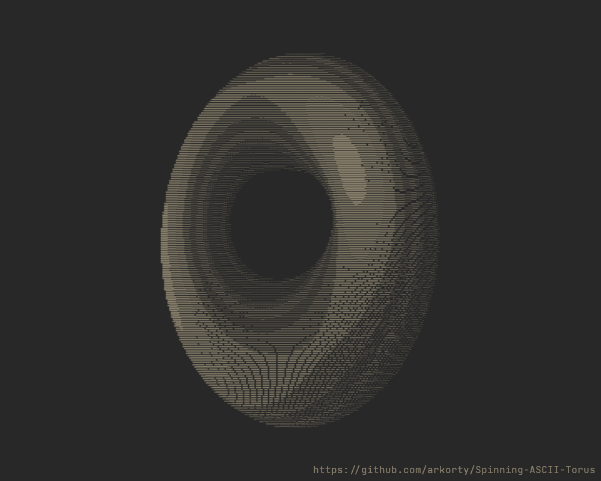

# Description

Spinning ASCII donut on the terminal. Original post by Andy Sloane can be found [here](https://www.a1k0n.net/2011/07/20/donut-math.html).

# How to run

- Clone or download and extract the repository
- Open a terminal inside the project directory
- Follow the steps for your Operating System

# For Windows

## Prerequisites for Windows

- Install a compiler like [MinGW-w64](https://sourceforge.net/projects/mingw-w64/)

## How to build and run

- `gcc -O2 -o donut.exe donut.c -lm` in the shell to compile using MinGW-w64
- `.\donut.exe` in the shell to run the program

# For Linux

## Prerequisites for Debian based distributions

- `sudo apt install gcc` to install the required compiler

## Prerequisites for Arch based distributions

- `sudo pacman -S gcc` to install the required compiler

## How to compile, run and clean

- `make` to build the program
- `make run` to execute the program
- `make clean` to remove the binary

# Updates

- Added support for dynamic resolution based on the size of the terminal
- Added Windows support
- Added support for dynamic resolution
- Added help option to the program

# Screenshot

